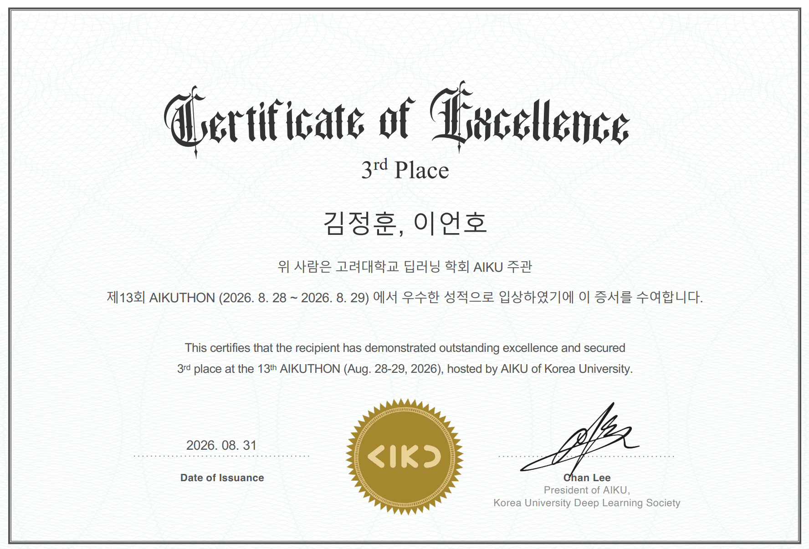
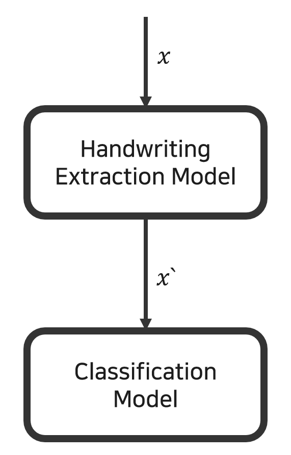
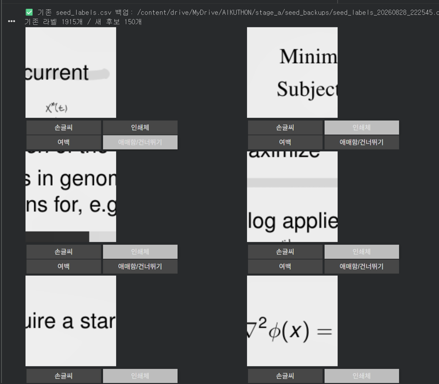
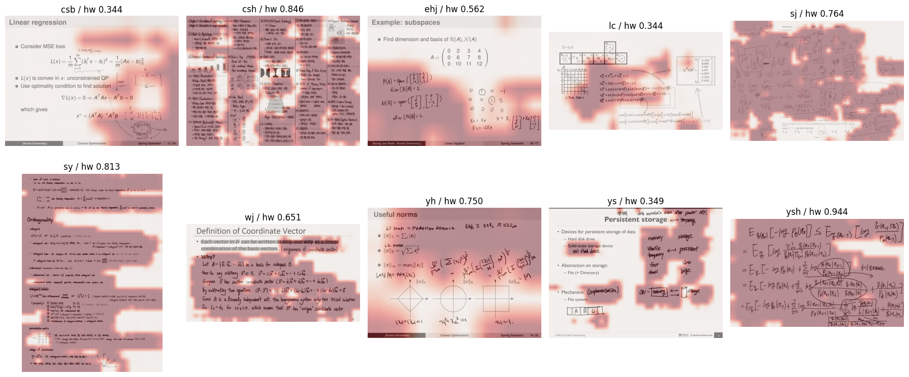

이번에 AIKU에서 주최하는 AIKUTHON에 참가하게 됐습니다. 첫 데이터톤이라 많이 설렜고, 제 역량이 어느정도인지 확인할 수 있어서 좋았습니다.

최종 3등으로 마무리할 수 있었습니다!



**AIKUTHON의 관련 내용은 다음과 같습니다.**
## Overview

### Description


 필적 감정(Forensic Handwriting Examination)은 문서의 작성자를 특정하는 고전적이면서도 여전히 활발히 연구되는 과제입니다. 사람의 필기 운동은 오랜 기간에 걸쳐 자동화된 근육 기억으로 굳어지며, 획의 기울기, 자소의 곡률, 필압의 분포, 글자 간 연결 방식에 개인 고유의 습관을 남깁니다. 이러한 특성은 의식적으로 통제하기 어렵기 때문에 신원 확인의 근거로 활용되어 왔습니다.
\
이번 대회의 목표는 부원 10명이 직접 작성한 약 1,200장의 필기 이미지를 바탕으로, 해당 필기가 누구의 손에서 나온 것인지 판별하는 다중 분류(Multi-class Classification) 모델을 개발하는 것입니다. 참가자들은 이미지에 적힌 문장의 내용이 아닌, 획을 긋는 방식과 자형을 구성하는 개인의 운동 패턴을 포착하여 판별 성능을 극대화해야 합니다.
\
이 과정에서 참가자들은 다음과 같은 기술적 챌린지에 직면할 것입니다:
\
내용 독립적 특성 추출: 모든 참여자가 동일한 문단을 옮겨 적었기 때문에, 글자의 종류나 단어의 배열은 단서가 되지 않습니다. 같은 글자를 서로 다르게 쓰는 방식만이 유효한 신호입니다.
\
촬영 조건에 대한 강건성: 필기 데이터는 서로 다른 날짜에, 서로 다른 필기구와 종이로 수집되었습니다. 테스트 데이터는 학습에 사용되지 않은 촬영 세션에서만 추출되었으므로, 종이의 질감이나 잉크의 색상에 의존한 모델은 리더보드에서 성능이 급락할 것입니다.

### Evaluation


 본 대회는 Multi-Class Macro F1 Score를 사용하여 모델의 성능을 평가합니다.
\
Macro F1이란? 각 작성자(클래스)별로 Precision·Recall을 구해 F1을 계산한 뒤, 11개 클래스의 F1을 단순 평균합니다(샘플 수 가중치 없음). 리더보드는 내림차순 정렬(높을수록 좋음).
\
왜 이 지표를 사용하나요? Accuracy는 클래스 불균형에 취약해서, 특정 작성자를 전부 틀려도 전체 정확도는 높게 나올 수 있습니다. Macro F1은 각 클래스를 동일 비중으로 반영하므로 소수 클래스 성능 저하가 그대로 드러나고, Precision/Recall을 동시에 봐서 특정 클래스로 몰아 찍는 전략에 페널티를 줍니다.
\
이해를 돕는 예시
\
작성자 3번 클래스 기준, 실제 3번인 이미지 10장 중 8장을 3번으로 맞히고(TP=8, FN=2), 3번이 아닌 이미지 중 4장을 3번으로 잘못 예측(FP=4)했다면:
\
Precision = 8/(8+4) = 0.667 Recall = 8/(8+2) = 0.800 F1 = 2×(0.667×0.800)/(0.667+0.800) ≈ 0.727
\
이 값을 11개 클래스 각각 구해서 평균 내면 Macro F1입니다.
\
Submission File 확률이 아니라 예측 클래스 하나만 제출합니다:

## Dataset Description

### Dataset Description

본 데이터셋은 AIKU 부원 10명이 직접 작성한 손글씨 이미지로 구성되어 있습니다. 참가자의 목표는 주어진 이미지가 누구의 필체인지 판별하는 10-class 분류 모델을 구축하는 것입니다. 본 대회는 글자의 내용이 아니라, 필기 습관에서 드러나는 개인 고유의 획 형태·기울기·간격·필압을 분석하는 능력을 평가합니다.
\
🛠️ 데이터셋 특성
학습 데이터와 평가 데이터는 서로 다른 조건에서 수집·가공되었습니다. 특정 문서나 배경에 과적합되지 않는 일반화된 필체 특징을 학습하는 것이 유리합니다.
\
Encrypted Test Set: 평가 데이터는 XOR 스트림 암호로 보호되어 있으며 `.npz` 형식으로 제공됩니다. 제공되는 `test_loader` 코드를 통해 복호화하여 모델 입력으로 사용하십시오. 복호화 결과를 화면에 출력하거나 파일로 저장하는 행위, 사람이 눈으로 보고 라벨을 부여하는 행위는 규칙 위반이며 실격 사유입니다.
\
Text-Region Cropping: 평가 이미지는 원본 페이지에서 필기가 존재하는 영역만 1024×1024 창으로 추출한 뒤 512×512로 리사이징한 것입니다. 한 페이지당 최대 3장이 추출되었으며, 각 조각은 독립적으로 채점됩니다. 따라서 페이지 전체 레이아웃이 아닌 국소적인 획 특징에 의존해야 합니다.


### Classes

작성자에 따라 총 10개의 클래스로 구분됩니다.

```table-config
align=left width=fit tint=gray tint-scope=header header=true
```
| Label | Writer | Label | Writer |
| :--- | :--- | :--- | :--- |
| 0 | csb | 5 | sy |
| 1 | csh | 6 | wj |
| 2 | ehj | 7 | yh |
| 3 | lc | 8 | ys |
| 4 | sj | 9 | ysh |

클래스 순서는 `test_loader`의 `CLASSES` 리스트와 동일합니다. `train/` 폴더명을 `ImageFolder`로 읽으면 자동으로 같은 순서가 됩니다.

### Format

제출 파일(`submission.csv`)은 아래 형식을 준수해야 합니다. `label`에는 예측한 클래스 인덱스(0~9 정수)를 입력하십시오.

평가 지표: F-Score (Macro) — 작성자별 F1 점수를 개별 산출한 뒤 단순 평균합니다. 표본 수가 적은 작성자도 동일한 비중으로 반영됩니다.

```table-config
align=left width=fit tint=gray tint-scope=header header=true
```
| id | label |
| :--- | :--- |
| 00411801b119 | 4 |
| 00897b520bf8 | 7 |

### Files

Files
- `train/` : 학습용 이미지 폴더 (작성자별 서브폴더로 구분, 829장 PNG, 원본 해상도)
- `test/` : 평가용 암호화 데이터 (490개 `.npz`, 512×512 RGB, 라벨 미제공)
- `sample_submission.csv` : 제출 양식 예시

## Rules

### Competition Rules

사용 언어: Python / 최대 30회 제출 가능 / 외부 데이터 사용 불가 / 사용에 문제 없는 (누구나 사용 가능한) 사전 학습 모델 (pre-trained model) 사용 가능 / 모델 학습 과정에서 테스트셋 활용 시 실격 처리 (Data leakage problem) / 코드 표절 검사 진행 (인터넷 상에 공개된 코드를 지나치게 베끼거나 팀끼리 코드를 공유할 경우 실격 처리) / Discussion 탭은 대회 안내 혹은 질의 응답 용도로 사용됩니다. 해당 탭을 활용한 팀 간의 코드 내지 의견 공유는 허용하지 않습니다.

- 평가 기준
\
리더보드 점수 = Public 40% + Private 60%
\
최종 점수 = (리더보드 정규화 점수 + 발표 평가 정규화 점수) ÷ 2

## Approach

대회 시작 후 팀원들과 데이터셋을 먼저 분석했습니다. 손글씨 데이터는 대부분 학교 강의 자료 위에 필기된 상태였습니다. 강의 자료마다 해상도, 펜의 종류와 두께가 달랐으며, class별 데이터 수의 불균형도 심해 적은 데이터와 많은 데이터를 다루는 방법에 고민이 많았습니다.

핵심 문제는 세 가지였습니다.

- 강의 자료 바탕으로 인한 심한 노이즈
- class 간 데이터 수의 큰 격차
- 해상도, 글씨 크기, 펜 두께 등 데이터의 가변성

이를 해결하기 위해 먼저 모델 아키텍처를 계획하고, 구현을 진행하며 점를 파악하고자 했습니다.

처음에 계획했던 모델의 구조는 다음 이미지와 같습니다.



raw input image $$x$$를 patch로 나누어 Handwriting Extraction Model을 통과하고, 해당 patch가 손글씨인지 인쇄체인지 분류하는 방식이엇습니다. 이후 손글씨로 분류된 patch $$x`$$만 Classification model를 통과하며 최종 class를 구하도록 설계했습니다.

Handwriting Extraction Model를 구현하고자 여러 해상도의 이미지를 patch로 쪼갠 후, supervised learning용으로 직접 labeling을 직접 진행했습니다. 초반에는 글씨체와 인쇄체가 섞인 patch를 글씨체로 labeling하였으나 extraction 모델의 성능이 낮게 나와 애매한 patch는 학습 데이터에서 제외했습니다. 이후 총 1,900개의 patch를 수작업으로 labeling 했습니다.

아래 사진과 같이 직접 labeling 했습니다.



이후 OpenCV를 활용하여 모델이 손글씨와 인쇄체를 정확하게 구분하고 있는지 시각화하여 검증했습니다.



추출된 영역만 활용하려 했으나, 시각화 결과를 확인해 보니 인쇄체 일부분이 여전히 포함되어 있었습니다. 대회가 진행되면서 주최측에서 참가자들의 모델 성능을 고려해 Test dataset은 글씨에 약간의 noise(점, 선, 채도 등)만 있다고 공지했습니다. 따라서 labeling을 중단하고 high quality의 input image를 얻기 위해 다른 방법을 시도했습니다.

raw image로 부터 손글씨 text 영역만 직접 crop하는 수작업 전처리를 선택했습니다. raw image의 수가 829개밖에 되지 않았기에, 좋은 성능의 extraction model을 개발해도 해당 quality를 보장할 수 없다고 생각했습니다. (앞서 주최측에서 공지한 hint까지 고려했습니다.) 따라서 약 5시간을 걸쳐 raw image를 직접 crop하여 전처리했습니다.

해당 dataset을 바탕으로 ResNet18을 적용했습니다. 데이터의 해상도가 작고 단순한 분류 과제였기에 ResNet18으로 충분하다고 판단했습니다. Crop된 이미지에 다양한 Augmentation(Resolution & Stroke Thickness Alignment, Image Rotation, Background Synthesis 등)을 적용해 제출한 결과, Kaggle 리더보드에서 0.3 대의 점수를 기록했습니다. 그러나 해당 점수를 기록한 모델의 parameter을 저장하지 못하는 실수를 하여, 추가적인 성능 향상을 하지 못했습니다.

이후 ResNet34 활용, 보정값 수정, seed 3개 앙상블, image angle를 수정해보며 계속 모델의 성능을 확인했습니다.

AIKUTHON 대회를 통해 다음을 깨달았습니다.
- AI에 대한 지식의 깊이가 부족하다.
- 검증 단계에서 Train / Val(Test)를 가져가는 것이 좋다.
- 데이터톤이 어떤 흐름으로 진행되는지 전체적인 감을 잡을 수 있었다.
- 마지막 발표 세선에서 다른 참가자들의 구현 방식과 아이디어를 보며 많은 자극과 배움을 얻을 수 있었다.
- high quality data가 결국 모델 성능의 핵심이다.
- 최적의 parameter를 save하는 습관을 기르자.

추가로, 여러 방법론을 구현하는 데에 어려움이 많아 대회 시간이 부족하게 느껴졌습니다. 초반에 철저히 계획하는 것 또한 중요한 거 같습니다.

이번 대회를 통해 해커톤과 데이터톤에 큰 흥미를 느끼게 되었으며, 앞으로도 꾸준히 참여하고자 합니다. 긴 글 읽어주셔서 감사합니다.
