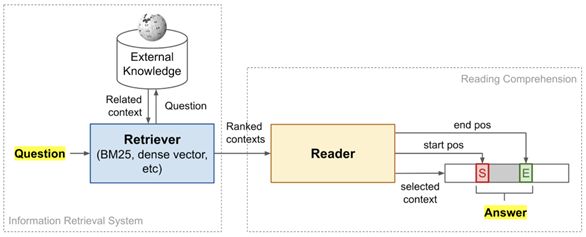
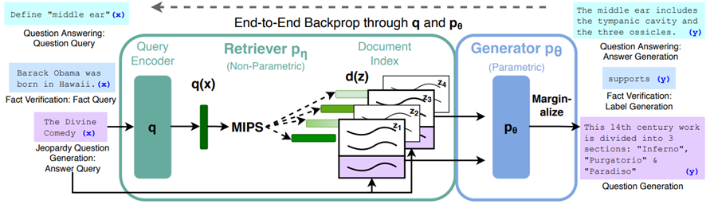
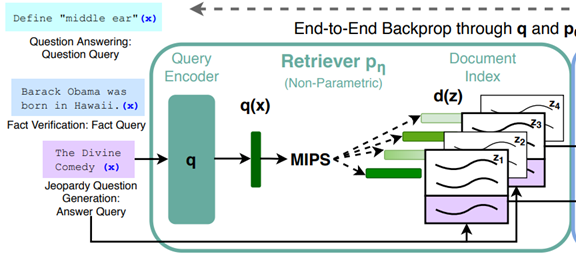
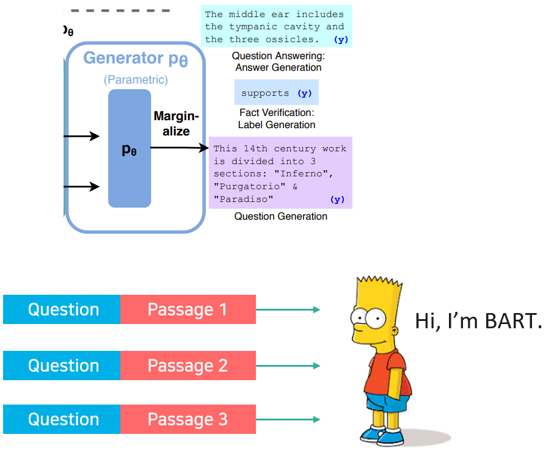
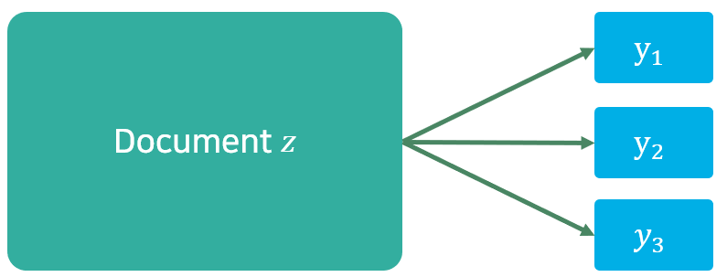
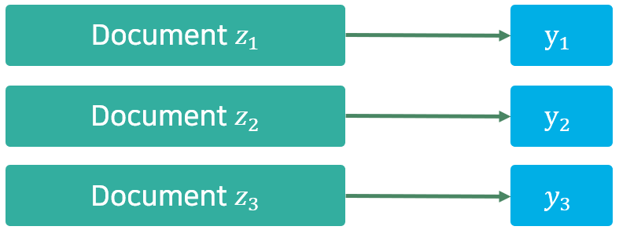
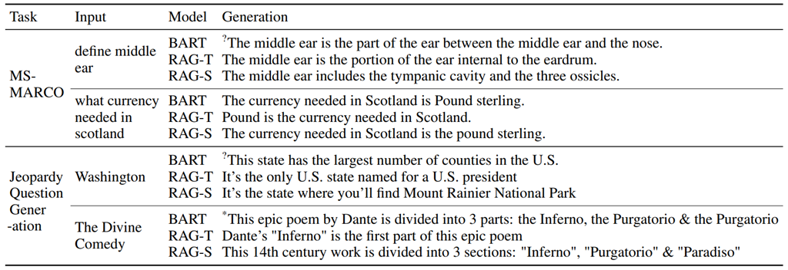
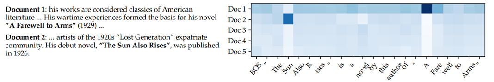
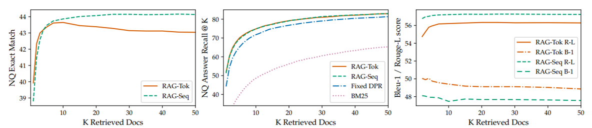

### 논문 한 줄 정리: 파라미터에 저장된 Knowledge과 검색해 가져온 지식을 함께 쓰고, 그 둘을 함께 학습하겠다.

해당 논문은 AIKU 기초논문스터디에서 발표한 논문으로, 발표 자료를 정리하며 글로 옮겼습니다.

## Background

### Parametric vs Non-parametric memory

- **Parametric memory**: 모델 파라미터 안에 사전학습을 통해 지식을 암묵적으로 저장한다.
- **Non-parametric memory**: 외부 문서를 벡터 인덱스로 저장해 두고, 필요할 때 검색해서 사용한다.

이 두 memory 개념은 QA 태스크의 두 갈래와 그대로 연결된다.

### Closed-book QA (parametric)

질문에 대한 passage를 제공하지 않은 채로 답변을 생성하게 하는 task이다.

- 외부 지식에 접근하지 않고 end-to-end 추론이 가능
- 지식이 파라미터 안에 있어 접근과 조작이 어려움 (사용자가 수정, 갱신 불가)
- hallucination이 발생 가능

### Open-Domain QA (non-parametric)



외부 지식에서 답변을 찾는 task이다.

- 외부 지식을 직접 사용하기 때문에 사용자가 수정·갱신 가능
- 보통 extractive하게 동작. 그러나 답을 새로 생성하는 것이 아니라 검색된 문서 안에서 정답에 해당하는 부분(span)을 찾아 뽑아내는 방식이라, 문서 안에 있는 표현으로 답이 제한됨.

## Introduction

선행 연구는 다음과 같이 크게 두 흐름이었다.

- **ORQA(2019), REALM(2020)** — non-parametric. | retriever로 정답을 외부 데이터베이스에서 찾자.
- **T5(2019), GPT-3(2020)** — parametric. | 대형 코퍼스로 사전학습된 언어모델은 이미 많은 정보를 파라미터 안에 갖고 있다.

RAG(2020)는 이 두 흐름을 융합한다. 사전학습된 seq2seq 모델을 parametric memory로, 위키피디아 문서의  vector index를 non-parametric memory로 함께 사용한다. 그리고 REALM이나 ORQA가 extractive QA에만 국한되어 있던 것과 달리, 답을 직접 생성하는 방식이라 다양한 seq2seq 태스크에 폭넓게 적용할 수 있다.



RAG의 전체 구조는 크게 Retriever와 Generator 두 부분으로 나뉜다. 입력 시퀀스인 Query $x$가 query encoder를 통과해 representation $q(x)$가 되고, $q(x)$가 MIPS(Maximum Inner Product Search) 과정을 통해 미리 인코딩해 둔 passage들 중 가장 가까운 top-$k$개를 찾는다. 이후 그 passage들과 입력 Query를 concat해 generator를 통과시켜 목표 시퀀스 $y$를 생성한다.

모델에서 사용하는 모델은 다음과 같다.

- **Query Encoder**: DPR Query Encoder
- **Passage Encoder**: DPR Passage Encoder
- **Generator**: BART-large

## Method

### Retriever: DPR



Query $x$는 Query Encoder를 통과해 $q(x)$가 되고, document $z$는 별도의 Document Encoder를 통과해 $d(z)$가 된다.

$$
d(z) = \mathrm{BERT}_d(z)
$$

$$
q(x) = \mathrm{BERT}_q(x)
$$

$$
p_\eta(z \mid x) \propto \exp\left(d(z)^\top q(x)\right)
$$

두 벡터의 내적이 크다는 것은 두 벡터가 가깝다는 뜻이고, 곧 높은 유사도를 의미한다. 이 내적값을 지수함수에 넣어 항상 양수가 되도록 만들고, 해당 값이 클수록 그 문서가 검색될 확률 $p_\eta(z \mid x)$가 높아진다.

정리하면, Query와 document를 각각 따로 인코딩해 벡터 공간상에서 가까운 문서를 찾는 것이 DPR의 핵심 아이디어이고, 이러한 유사도 점수가 가장 높은 top-$k$개의 문서를 MIPS를 통해 찾아낸다.

### Generator: BART

검색한 문서 $z$를 실제 답을 생성하는 데 쓰는 부분이 Generator다. 다음 토큰을 생성할 확률은 아래와 같이 표현된다.



$$
p_\theta(y_i \mid x, z, y_{1:i-1})
$$

지금까지 생성한 토큰들 $y_{1:i-1}$, 기존 Query $x$, 그리고 검색된 document $z$로 다음 토큰을 생성한다. 일반적인 seq2seq 모델의 조건부확률에 검색된 문서 $z$ 하나가 더 추가된 것뿐이다.

앞서 말했듯 Query $x$와 document $z$를 concat해 BART의 input으로 넣는다. 논문에서 사용하는 모델은 BART-large로, 4억 개 파라미터를 가진 seq2seq transformer다. 이 BART의 파라미터 $\theta$가 바로 앞에서 말한 parametric memory에 해당한다.

### RAG-Sequence


논문은 두 가지 RAG 방식을 제시한다. 먼저 RAG-Sequence는 **하나의 문서를 골라 그 문서 하나로 전체 시퀀스를 생성**한다.



$$
p_{\text{RAG-Sequence}}(y \mid x) \approx \sum_{z \in \text{top-}k(p(\cdot \mid x))} p_\eta(z \mid x)\, p_\theta(y \mid x, z) = \sum_{z \in \text{top-}k(p(\cdot \mid x))} p_\eta(z \mid x) \prod_i p_\theta(y_i \mid x, z, y_{1:i-1})
$$

앞의 항 $p_\eta(z \mid x)$는 retriever가 문서 $z$를 뽑을 확률이고, 뒤의 항 $p_\theta(y \mid x, z)$는 그 문서로 전체 시퀀스 $y$를 생성할 확률이다. 우리가 최종적으로 알고 싶은 것은 문서 $z$와 상관없이 $y$가 나올 확률 $p(y \mid x)$이므로, 이 곱셈 값을 top-$k$개의 문서 전부에 대해 더한다. 이 과정을 marginalize라고 한다.

간단한 예로 "AIKU가 뭐야?"라는 질문에 retriever가 관련 문서 세 개를 가져왔다고 하자.

```table-config
align=center width=fit
```

| 문서 $z$ | 검색 확률 $p_\eta(z \mid x)$ | 정답 생성 확률 $p_\theta(y \mid x, z)$ | 곱 |
| --- | --- | --- | --- |
| 대학교 인공지능 동아리 문서 | 70% | 90% | 63% |
| 고려대학교 문서 | 20% | 30% | 6% |
| 인공지능 문서 | 10% | 10% | 1% |

$$
p(y \mid x) = 63\% + 6\% + 1\% = 70\%
$$

그리고 위 식에서 $p_\theta(y \mid x, z)$ 부분을 토큰 단위로 풀어쓸 수 있는 이유는, 전체 시퀀스의 확률이 결국 토큰 $y_1, y_2, y_3$을 순서대로 생성하는 확률들을 모두 곱한 것과 같기 때문이다. 여기서 중요한 것은 이 곱 안에서 **문서 $z$가 계속 하나로 고정되어 있다**는 점이다. 처음부터 끝까지 같은 문서 하나로 전체 시퀀스를 생성한다는 뜻이다.

### RAG-Token

RAG-Token은 **토큰을 생성할 때마다 다른 문서를 참조**할 수 있다.



$$
p_{\text{RAG-Token}}(y \mid x) \approx \prod_i \sum_{z \in \text{top-}k(p(\cdot \mid x))} p_\eta(z \mid x)\, p_\theta(y_i \mid x, z, y_{1:i-1})
$$

RAG-Sequence 식과 비슷하지만, 차이점은 $\sum$와 $\prod$의 순서가 바뀌었다는 점이다. RAG-Sequence는 문서 $z$를 먼저 하나 고정해 놓고 그 문서로 전체 토큰을 생성했다. 반면 RAG-Token은 토큰 $y_i$ 하나를 생성할 때마다 그 시점에서 top-$k$ 문서 전부에 대해 다시 marginalize를 하고, 이 과정을 출력 시퀀스의 토큰 개수만큼 반복해 전부 곱한다.

그래서 $y_1$을 생성할 때 marginalize한 결과와 $y_2$를 생성할 때 marginalize한 결과에서, 같은 top-$k$ 안의 문서 weight가 서로 다를 수 있다. 바로 이 부분이 RAG-Token이 토큰마다 다른 문서를 참조할 수 있다고 말하는 이유다.

추가로 논문은, 출력 시퀀스의 길이가 1인 경우 — 즉 분류 태스크처럼 클래스 하나만 예측하면 되는 경우에는 어차피 토큰이 하나뿐이라 $\sum$와 $\prod$의 순서가 결과에 영향을 주지 않으므로, RAG-Sequence와 RAG-Token이 완전히 동일해진다고 설명한다.

## Decoding

디코딩 방식도 두 모델이 다르다.

```table-config
align=center
```

| | RAG-Token | RAG-Sequence |
| --- | --- | --- |
| 방식 | 표준 beam search를 그대로 사용 | 문서별로 beam search를 따로 수행 |
| 이유 | 토큰 하나당 확률 하나가 나오는 형태가 일반 autoregressive 모델과 동일하다 | $p(y \mid x)$가 문서별 확률의 합이라 하나의 beam으로 한 번에 못 푼다 |

RAG-Token은 매 토큰마다 marginalize를 끝내버리기 때문에, 토큰 하나당 확률 하나가 나오는 형태가 일반적인 autoregressive 모델과 똑같다. 반면 RAG-Sequence는 marginalize를 문서 단위로 하므로 시퀀스를 다 만든 다음 맨 마지막에 더해야 한다. 그래서 문서마다 beam search를 따로 돌린 다음 결과를 합쳐야 한다.

여기서 문제가 생긴다. 검색된 문서가 passage 1, 2, 3 세 개일 때 각각에 대해 beam search를 따로 돌리면, 그 결과로 문서마다 서로 다른 후보 문장이 나온다. 예를 들어 어떤 후보 $y_3$은 오직 passage 1의 beam에서만 나오고, passage 2나 3의 beam search는 $y_3$이라는 문장을 아예 만들어 내지 못했을 수 있다. 그런데 최종적으로 $p(y_3 \mid x)$를 구하려면 정의상 $z_1, z_2, z_3$ 문서 전부에 대한 항을 더해야 하므로, beam search 과정에서 탐색되지 못한 항들이 생긴다.

논문은 이를 두 가지 방법으로 처리한다.

- **Thorough decoding**: 탐색되지 못한 문장을 해당 문서와 함께 모델에 forwarding해서 logit을 직접 계산한다. 정확하지만 beam 크기가 커질수록 연산량이 가중된다.
- **Fast decoding**: 탐색되지 못한 항의 확률을 그냥 0으로 간주한다. 추가 연산 없이 훨씬 빠르게 계산할 수 있지만, 정확한 값이 아니라 근사치라는 한계가 있다.

## Training

RAG는 **어떤 문서를 검색해야 하는지에 대한 직접적인 정답 없이** 학습이 이루어진다. 목적함수는 각 target의 negative marginal log-likelihood를 최소화하는 것이다.

$$
\sum_j -\log p(y_j \mid x_j)
$$

학습 데이터에 있는 모든 질문-정답 쌍에 대해 모델이 정답 $y_j$를 낼 확률 $p(y_j \mid x_j)$를 구하고, 여기에 마이너스 로그를 씌운다. 정답을 잘 맞힐수록 값이 작아지고, 못 맞힐수록 커진다. 이 값을 모든 데이터에 대해 더한 것이 최종 loss다.

이 확률 $p(y \mid x)$ 안에는 이미 문서 $z$가 marginalize되어 있고, 이 loss의 gradient는 backpropagation하면 generator뿐만 아니라 retriever까지 함께 흐른다. 이를 통해 "어떤 문서가 정답에 도움이 된다"고 직접 알려 주지 않았는데도 end-to-end로 함께 학습될 수 있다.

retriever가 학습되는 이유는 $p(y \mid x)$를 계산하는 수식 안에 $p_\eta(z \mid x)$라는 retriever의 확률이 곱셈 항으로 들어가 있기 때문이다. 그 확률값을 만드는 계산 과정 안에 retriever의 파라미터가 남아 있으므로, 결과만 보고도 거꾸로 retriever를 학습시킬 수 있다.

한편 document encoder $\mathrm{BERT}_d$는 **freeze** 한다. document encoder까지 계속 업데이트하면 2100만 개에 달하는 문서 인덱스를 매번 다시 만들어야 해서 비용이 매우 크기 때문이다. 그래서 query encoder $\mathrm{BERT}_q$와 BART generator만 fine-tuning한다. 문서를 인코딩하는 함수 자체가 안 바뀌니 문서 벡터도 안 바뀌지만, 어떤 문서를 골라오는지는 학습 중 계속 바뀐다. query encoder가 학습되면서 $q(x)$가 변하기 때문이다.

## Experiments

### Open-Domain QA

기존 QA 모델과 다르게 generation으로 접근했다는 점이 핵심이다.

```table-config
align=center
```

| | Model | NQ | TQA | WQ | CT |
| --- | --- | --- | --- | --- | --- |
| Closed Book | T5-11B | 34.5 | - / 50.1 | 37.4 | - |
| Closed Book | T5-11B+SSM | 36.6 | - / 60.5 | 44.7 | - |
| Open Book | REALM | 40.4 | - / - | 40.7 | 46.8 |
| Open Book | DPR | 41.5 | 57.9 / - | 41.1 | 50.6 |
| | RAG-Token | 44.1 | 55.2 / 66.1 | **45.5** | 50.0 |
| | RAG-Sequence | **44.5** | 56.8 / **68.0** | 45.2 | **52.2** |

기존에 단순히 추출식 Reader를 썼을 때보다 DPR retriever의 성능이 좋았고, 외부 지식을 사용하지 않는 closed-book 모델보다도 좋은 성능을 보였다. BART의 parametric 지식과 위키피디아에서 가져오는 DPR의 non-parametric 지식을 함께 사용하면서, 기존에 있던 모델들보다 더 좋은 성능을 보인다.

특히 **검색해 온 문서에 정답이 포함되어 있지 않은 경우에도 모델이 정답을 스스로 생성하는 모습을 보였다.** 이 경우 추출식 모델의 정답률은 0%지만 RAG는 11.8%였다.

사용된 데이터셋은 다음과 같다.

- **NQ (Natural Questions)**: 구글 검색 Query를 기반으로 한 실제 사용자 질문과 위키피디아 정답 문서로 구성된 데이터셋
- **TQA (TriviaQA)**: 퀴즈 대회나 트리비아 팬사이트 등에서 수집한 복잡한 상식 및 사실 기반의 질의응답 데이터셋
- **WQ (WebQuestions)**: 구글 제안 검색 API를 통해 수집한 웹 기반의 비교적 단순한 개체명 중심 질문 데이터셋
- **CT (CuratedTrec)**: TREC QA 태스크에서 파생된 데이터셋으로, 특정 사실 정보를 묻는 질문들로 구성

### Jeopardy Question Generation, MS MARCO, FEVER

```table-config
align=center
```

| Model | Jeopardy B-1 | Jeopardy QB-1 | MSMARCO R-L | MSMARCO B-1 | FVR3 Label Acc. | FVR2 Label Acc. |
| --- | --- | --- | --- | --- | --- | --- |
| SotA | - | - | 49.8* | 49.9* | 76.8 | 92.2* |
| BART | 15.1 | 19.7 | 38.2 | 41.6 | 64.0 | 81.1 |
| RAG-Token | **17.3** | **22.2** | 40.1 | 41.5 | 72.5 | 89.5 |
| RAG-Sequence | 14.7 | 21.4 | 40.8 | 44.2 | 72.5 | 89.5 |

보시는 것처럼 BART에 비해 RAG가 전반적으로 좋은 성능을 보이고 있다. SotA가 MS MARCO나 FEVER에서 더 좋은 성능을 보이고 있는데, 이는 **정답 문서를 직접 입력으로 준 경우**, 즉 gold context를 준 경우임을 고려할 필요가 있다. 정답 문서가 없어 스스로 검색해서 풀어야 했던 모델 중 가장 성적이 좋은 것이 여기 밑줄 쳐진 RAG다. 이를 통해 전반적으로 성능이 좋아졌음을 확인할 수 있다.

지표는 다음과 같다.

- **B-1 (BLEU-1)**: 생성된 텍스트와 정답 텍스트 간 1-gram 단위의 일치율을 측정하는 지표. 짧은 문장 생성을 막기 위한 Brevity Penalty가 적용된다.
- **QB-1 (Q-BLEU-1)**: 질문 생성 태스크에 맞게 BLEU를 개체명·질문 유형 등을 고려하도록 보정한 지표.
- **R-L (ROUGE-L)**: 모델이 생성한 문장과 정답 문장 사이의 최장 공통 부분 수열(LCS)을 찾아 얼마나 많은 내용을 커버했는지 재현율 위주로 측정한다. 주로 문서 요약 평가에 적합하다.
- **Label Acc.**: 팩트 검증(Fact Verification) 태스크에서 모델이 올바른 레이블을 예측했는지를 보는 정확도.

### Hallucination



Abstractive QA 예시를 보면 BART에 비해 RAG의 hallucination이 적다.

예를 들어 "define middle ear"를 input했을 때 BART는 "The middle ear is the part of the ear between the middle ear and the nose"처럼 없는 말을 지어내는 모습을 보인다. 반면 RAG-Sequence는 "The middle ear includes the tympanic cavity and the three ossicles."라는 적절한 답을 생성한다.

### RAG-Token의 문서 posterior 시각화

Jeopardy Question Generation에서 Hemingway를 입력했을 때, RAG-Token 모델이 각 토큰을 생성할 때의 passage별 posterior를 시각화한 실험이다.



- "The Sun Also Rises"를 생성할 때는 Document 2의 posterior가 Document 1보다 높다.
- "A Farewell to Arms"를 생성할 때는 Document 1의 posterior가 Document 2보다 높다.

즉 토큰마다 실제로 서로 다른 문서를 가져다 쓰고 있다는 것을 확인할 수 있다. 그리고 각 주제별 첫 번째 토큰을 생성한 뒤에는 유독 어떤 문서가 Attention이 많이 가해지는 것을 볼 수 있는데, 이 부분은 첫 번째 토큰을 생성할 때 non-parametric 지식이 많이 사용되고, 이후 부분은 parametric 지식으로 채워진다고 추론할 수 있다.

### 검색 문서 수 K

검색하는 문서의 수를 조절하며 실험한 부분이다.



- **RAG-Sequence**는 검색하는 문서 수가 늘어날수록 성능이 개선된다.
- **RAG-Token**은 문서 수가 일정 수 이상이면 성능이 저하된다.
- Answer Recall@$K$(검색된 문서에 정답이 포함되어 있을 확률)는 당연히 문서 수가 많아질수록 올라가는데, BM25보다 DPR 기반 모델이 훨씬 우수하다.
- ROUGE-L과 BLEU 점수로 보면, 문서를 많이 검색할수록 RAG-Token은 점수가 높게 유지되거나 올라가지만 RAG-Sequence는 오히려 점수가 낮아진다. RAG-Sequence는 검색된 여러 문서 중 딱 하나의 문서만으로 전체 시퀀스를 생성하기 때문에, 문서 수가 너무 많아질수록 정답과 동일할 확률이 낮아진다. 반면 RAG-Token은 단어를 만들 때마다 여러 문서를 동시에 참고해서 토큰 단위로 계산하기에 정답과 동일하게 만들 수 있다.

### Ablation study

```table-config
align=center
```

| Model | NQ | TQA | WQ | CT | Jeopardy B-1 | Jeopardy QB-1 | MSMARCO R-L | MSMARCO B-1 | FVR-3 | FVR-2 |
| --- | --- | --- | --- | --- | --- | --- | --- | --- | --- | --- |
| RAG-Token-BM25 | 29.7 | 41.5 | 32.1 | 33.1 | 17.5 | 22.3 | 55.5 | 48.4 | **75.1** | **91.6** |
| RAG-Sequence-BM25 | 31.8 | 44.1 | 36.6 | 33.8 | 11.1 | 19.5 | 56.5 | 46.9 | **75.1** | **91.6** |
| RAG-Token-Frozen | 37.8 | 50.1 | 37.1 | 51.1 | 16.7 | 21.7 | 55.9 | 49.4 | 72.9 | 89.4 |
| RAG-Sequence-Frozen | 41.2 | 52.1 | 41.8 | 52.6 | 11.8 | 19.6 | 56.7 | 47.3 | 72.9 | 89.4 |
| RAG-Token | 43.5 | 54.8 | **46.5** | 51.9 | **17.9** | **22.6** | 56.2 | **49.4** | 74.5 | 90.6 |
| RAG-Sequence | **44.0** | **55.8** | 44.9 | **53.4** | 15.3 | 21.5 | **57.2** | 47.5 | 74.5 | 90.6 |

FEVER는 분류 태스크이므로 두 RAG 모델이 동일하다.

- **Retriever를 DPR이 아닌 BM25로 교체**하면 대부분의 태스크에서 성능이 낮아진다. 다만 FEVER에서는 BM25가 더 높은 성능을 보이고 있는데, FEVER는 fact checking을 하는 사실 확인 태스크라 실제 문서에서 중요 토큰이 존재했는지가 핵심 요소가 된다. 즉 의미적 정보보다 키워드 매칭이 중요하기 때문에 BM25도 좋은 성능을 보이고 있다고 유추할 수 있다.
- **Retriever를 freeze하고 generator만 학습**시키면 성능이 떨어진다. retriever까지 end-to-end로 함께 학습하는 것이 더 좋음을 확인할 수 있다.

마지막으로, 각 연도의 리더를 출력하는 태스크로 knowledge base를 교체하는 실험을 진행했다.

```table-config
align=center width=fit
```

| | 2016 Wikipedia | 2018 Wikipedia |
| --- | --- | --- |
| 2016 Leaders | 0.70 | 0.12 |
| 2018 Leaders | 0.04 | 0.68 |

동일 연도의 위키피디아를 사용해 그 연도의 리더를 맞히는 경우, 즉 2016 위키피디아로 2016년의 리더를 맞히는 것은 높은 성능을 보였다. 반대로 다른 연도의 리더를 맞힐 때는 정확도가 내려감을 확인할 수 있다. 이를 통해 knowledge base에 따라 성능이 직접적으로 변한다는 것을 알 수 있다. 바꿔 말하면, 모델을 다시 학습시키지 않고 인덱스만 갈아끼워도 지식을 갱신할 수 있다는 뜻이다.

## 정리

- RAG는 parametric memory(BART)와 non-parametric memory(위키피디아 dense index)를 하나로 묶는다.
- 문서를 marginalize하는 방식에 따라 RAG-Sequence와 RAG-Token으로 나뉜다.
- 어떤 문서를 검색해야 하는지에 대한 직접적인 supervision 없이, retriever와 generator가 end-to-end로 함께 학습된다.
- 검색된 문서에 정답이 없어도 답을 생성할 수 있고, hallucination이 BART보다 적으며, 인덱스 교체만으로 Knowledge을 갱신할 수 있다.

참고 : 서울대학교 산업공학과 DSBA 연구실
