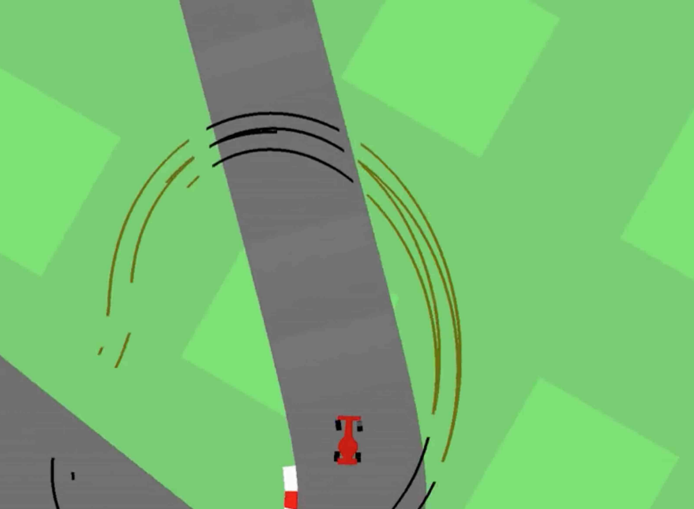
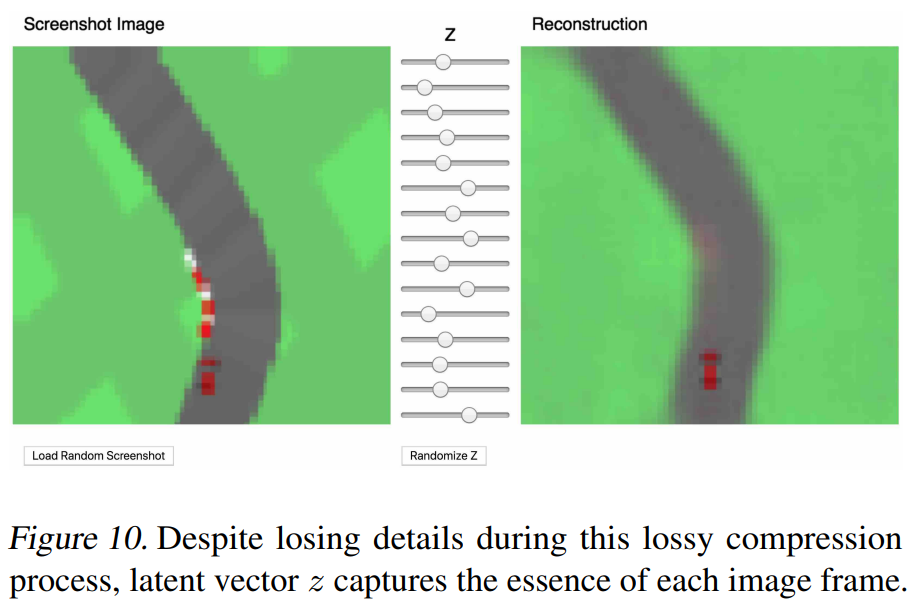
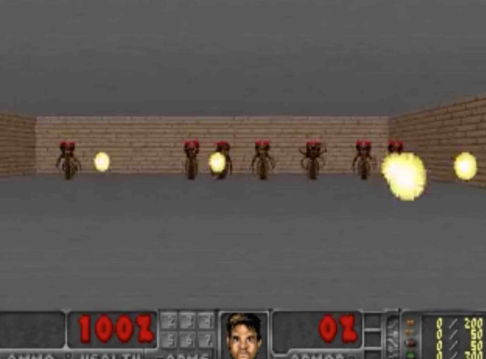
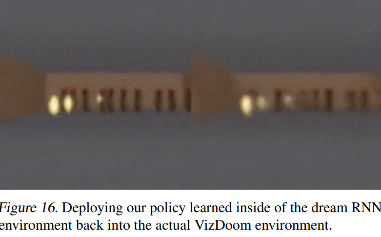

### 논문 한 줄 정리: 강화학습 환경을 신경망 모델로 대체하겠다.

## Abstract

- World model로부터 나온 feature를 agent(controller)의 input으로 사용하여, compact하고 simple한 policy를 학습시킬 수 있다. (world model로 image를 encoding하여 중요한 feature만 추출한다. 이러한 feature를 input으로 사용하는 것)
- World model은 agent의 dream을 생성하게 되고, agent는 그 dream을 통해 학습할 수 있다. 즉, 상상을 통해 학습할 수 있다.

## Introduction

- 우리 인간의 뇌는 세상의 모든 것이 아니라, 우리가 살아가는 세상의 추상적인 정보(공간, 시간), 묘사를 기억하고, 배운다.
- 우리가 인지하는 것은, 미래에 대한 뇌의 예측이 많이 섞여 있다.
- 뇌에 있는 예측 모델은 단순 미래를 예측하는 것이 아니라, 현재 운동 상태를 고려했을 때, 앞으로의 감각 데이터를 예측하는 것이다. (따라서 반사 반응이 가능해진다.) → 우리가 100 mph의 공을 칠 수 있는 것은, when and where the ball will go를 예측할 수 있기 때문이다.
- RNN이 크면 (parameter가 많을수록) 시공간 표현을 더 잘 학습할 수 있지만, 많은 model-free RL은 적은 parameter를 사용한다. 왜냐하면 credit assignment problem 때문에 large model에서 병목이 발생한다. 그래서 지금까지 대부분 작은 networks를 사용하고 있었다. → large RNN-based agents를 학습시키기 위해, model-based 방식(Large world model + small controller model)을 채택했다.

## Agent Model

### VAE (V) Model

video sequence인 2D image를 input으로 받아, abstract하고 compressed한 representation으로 만든다. 즉, small latent vector $z$로 압축한다.

### MDN-RNN (M) Model

predict the future, 즉 앞으로 생길 $z$를 예측하는 모델이다. environment는 deterministic하지 않고 stochastic하기에, $z_{t+1}$보다는 $p(z_{t+1})$을 출력하도록 train한다.

$P(z_{t+1} | a_t, z_t, h_t)$

$a_t$ is the action taken at time $t$
$h_t$ is the hidden state of the RNN at time $t$ (즉, 지금까지 봐온 $z$들과 action을 요약한 것 | 기억)

sampling 과정에서 temperature parameter $τ$를 조절할 수 있다. (꿈을 얼마나 불확실하게 만들지, 즉 미래를 예측할 때 얼마나 다양하고 무작위적으로 예측하게 할지를 정하는 값이다.)

### Controller (C) Model

environment에서 agent의 기대 누적 보상을 최대화하기 위해 action의 흐름을 결정한다. C를 최대한 간단히 만들고, V와 M에서 분리한다 (V, M, C는 separately train된다). 이로써 agent 모델의 대부분의 복잡성은 world model (V and M)에 존재하게 된다.

$a_t = W_c[z_t, h_t] + b_c$       \
C는 single layer linear model이다.

$W_c$ is the weight matrix and $b_c$ is the bias vector.

### Flow

the environment → the raw observation → V → produce $z_t$ → $z_t, h_t$ → C → produce $a_t$ → affect the environment
and $z_t, a_t, h_t$ →  M update hidden state to produce $h_{t+1}$ (predict $z_{t+1}$ through MDN)

논문에서 Controller를 작게 설계하였는데, 이를 통해 여러 가지 실용적인 이득을 볼 수 있었다. 우선 딥러닝은 model을 크고, 복잡하게 훈련할 수 있게 하고, loss function을 differentiable하게 할 수 있었다. V와 M model을, backpropagation을 통해 훈련할 수 있도록 설계했고, 이를 통해 모델의 복잡도를 형성할 수 있었다. 그래서 대부분의 모델 파라미터는 V, M model에 있다. 이에 비해 C model의 파라미터는 상대적으로 minimal하다. 이를 통해 기존 RL task에 있는 credit assignment problem을 해결할 수 있었다.

C의 파라미터를 최적화하기 위해, Covariance Matrix Adaptation Evolution Strategy (CMA-ES)를 선택했다.

## Experiments

### Car racing

저자들은 agent가 car racing 문제를 풀 수 있도록, 먼저 이 task의 score를 어떻게 정의하는지 설명한다.

미래를 잘 예측하는 world model은 space와 time에 대한 유용한 representation을 뽑아낼 수 있다. 이렇게 뽑은 feature를 controller의 input으로 주면, 연속적인 control task를 수행하도록 학습시킬 수 있다.

해당 environment에서 track은 매 trial마다 새로 생성되며, 최소한의 시간에 최대한 많은 tile을 방문하면 reward를 받도록 agent를 설계했다. Agent는 steering left/right, acceleration, brake라는 3개의 연속적 action을 갖고 있다.

V 모델을 학습하기 위해, 저자들은 10,000번의 random rollout을 수행했다.

처음에는 agent가 environment를 randomly하게 탐색할 수 있게 했다. 이후 random action $a_t$와 그로 인한 observation을 기록했고, 이 dataset으로 V 모델이 관측된 각 frame의 latent space를 학습할 수 있게 했다. 이후 decoder가 $z$로부터 생성한 reconstructed version of the frame과 실제 frame을 비교하며, VAE가 각 frame을 low dimensional한 latent vector $z$로 encode하는 것을 학습시켰다.

V 모델을 활용하여, M 모델을 학습시키기 위한 frame을 $z_t$로 pre-process하고, 이 pre-processed data를 MDN-RNN을 학습시키는 데에 사용할 수 있다.

World model은 환경으로부터 오는 실제 reward signal을 모른다. 오직 C 모델만이 access를 갖고 있다.

실제 rollout 동안 VAE가 reconstruct하는 것을 아래 사진을 통해 확인할 수 있다.

또한 $z$ vector를 조정하며, 어떤 것이 reconstruction에 영향을 미치는지도 확인할 수 있다.

### VizDoom

VizDoom에서는 '우리의 agent가 dream 안에서 배우는 것을 확인했다면, 이 policy를 실제 환경으로 다시 transfer할 수 있을까?'를 확인하고자 했다.

(저자들은 world model이 목적에 맞게 정확했다면 실제 환경에서도 대체 가능하다고 적어두긴 했다. 근데 world model을 actual environment와 거의 비슷하게 만드는 것이 실제로 가능할지가 의문이긴 하다.)

VizDoom에서는 몬스터들이 쏘는 fireball을 피하기만 하면 된다. explicit한 reward가 없어, 누적 보상으로 '오래 피하며 살기'만 하면 되게 했다. 각 rollout은 최대 2100 time steps(대략 60초)까지 돌아가며, 연이은 rollout들의 평균 생존 시간이 750 time steps(~20초)보다 많으면 task를 solved했다고 간주했다.

Car racing의 experiment setup과 거의 비슷했다고 한다. Car racing에서는 M 모델이 오직 $z_t$를 model하게 훈련만 되었다면, 여기에서는 agent가 next frame에서 죽는지도 예측한다. (as a binary event $done_t$, or $d_t$)

시뮬레이션에서는, hallucination process 동안 V 모델로 encode할 필요가 없기에, agent는 오직 latent space 환경에서만 훈련하면 됐다. 이는 많은 advantage를 가져왔다.

가상 환경은 실제 환경과 동일한 interface를 가졌으며, 이는 나중에 agent가 satisfactory policy를 가상 환경에서 배울 수 있게 된다. 이러한 policy를 실제 환경으로 가져와 얼마나 transfer되는지 확인할 수 있다.

이후 실제 게임을 보면, left, right로 잘 움직이는 것을 확인할 수 있고 벽 뒤로 넘어가는 것을 잘 막는 것을 확인할 수 있다고 한다. 가끔은 여러 fireball이 날아올 때 잘 움직이는 것을 확인할 수 있다. 이는 agent가 fireball에 맞으면 죽을 수 있다는 것을 잘 detect한다고 할 수 있을 것이다.

그리고 temperature $τ$ parameter를 넣어 $z_{t+1}$을 sampling하는 과정을 더 uncertain하게 할 수 있다. 이는 가상 환경을 실제 환경보다 좀 더 어렵게 할 수 있다. $τ$를 높게 할수록 agent가 기본 $τ$보다 더 잘 수행하는 것을 확인할 수 있고, 또한 world model의 imperfection을 악용하는 것 또한 막을 수 있다.

V 모델이 각 frame의 detail을 모두 잡진 못하지만, agent는 여전히 실제 환경에서 잘하는 것을 확인할 수 있다. 가상 환경은 몬스터의 수(# of monsters)를 정확하게 track하지 못하는 noisy한 환경이기에, 실제 환경에서 더 잘할 수 있을 거라고 한다.

### Cheating the World Model

저자들은 처음에 agent가 adversarial policy를 찾아낸다는 것을 알고 있었다. M 모델이 지배하는 가상 환경에서, 특정 방식으로 움직여 일부 rollout 동안 몬스터가 fireball을 쏘지 않게 하는 policy였다고 한다. 초능력자같이 특정 방향으로 움직여서… fireball을 없앴다고 한다.

이런 일이 생기는 이유는 world model이 환경을 근사한 확률 모델이라, 실제 환경의 규칙을 따르지 않는 trajectory를 만들어낼 수 있기 때문이다. C는 M의 hidden state를 전부 입력으로 받는데, 이 부분은 agent에게 game engine의 내부 상태와 메모리를 다 보여주는 것과 같아, agent는 보상을 최대화하면서 game engine의 hidden state를 직접 조작하는 방법을 쉽게 찾아낼 수 있다.

이로 인해, agent는 M 안에서는 좋아 보이지만 실제 환경에서는 통하지 않는 adversarial policy를 찾게 된다. 이 부분을 막기 위해 저자들은 dynamics model로 MDN-RNN을 사용했다. MDN-RNN은 미래를 하나로 예측하는 것이 아니라, 실제 환경에서 나올 수 있는 결과들의 분포를 모델링한다. 따라서 실제 환경이 deterministic해도, M은 stochastic한 환경으로 근사한다. 여기서 $τ$를 통해 tradeoff (**realism ↔ exploitability**)를 조절할 수 있다. M 모델의 temperature를 높이면 C 모델이 adversarial policy를 찾기 어려워지지만, 너무 많이 높이면 가상 환경이 agent가 아무것도 배울 수 없을 만큼 어려워진다.

## 정리

- World model(V + M)이 환경을 압축·예측하고, controller(C)는 그 representation만 보고 action을 고른다.
- V(VAE)는 각 frame을 latent vector $z$로 압축하고, M(MDN-RNN)은 다음 $z$를 하나로 예측하는 대신 그 분포 $p(z_{t+1})$을 예측한다.
- 모델 파라미터의 대부분을 V·M에 두고 C는 single layer linear model로 작게 유지해, 기존 RL의 credit assignment problem을 피하고자 했다.
- M이 만든 가상 환경(dream) 안에서만 policy를 학습시킨 뒤, 그 policy를 실제 환경으로 transfer할 수 있다.
- 가상 환경은 환경을 근사한 확률 모델이라 agent가 그 허점을 악용하는 adversarial policy를 찾을 수 있고, temperature $τ$로 realism과 exploitability의 tradeoff를 조절한다.
