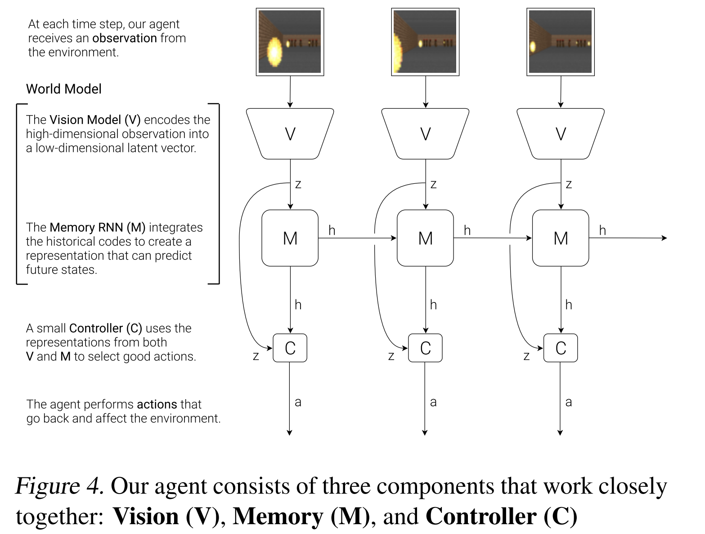
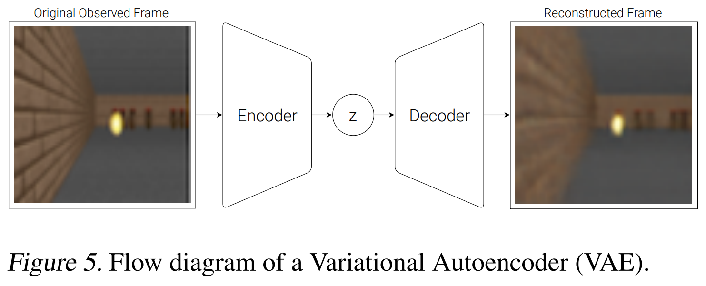
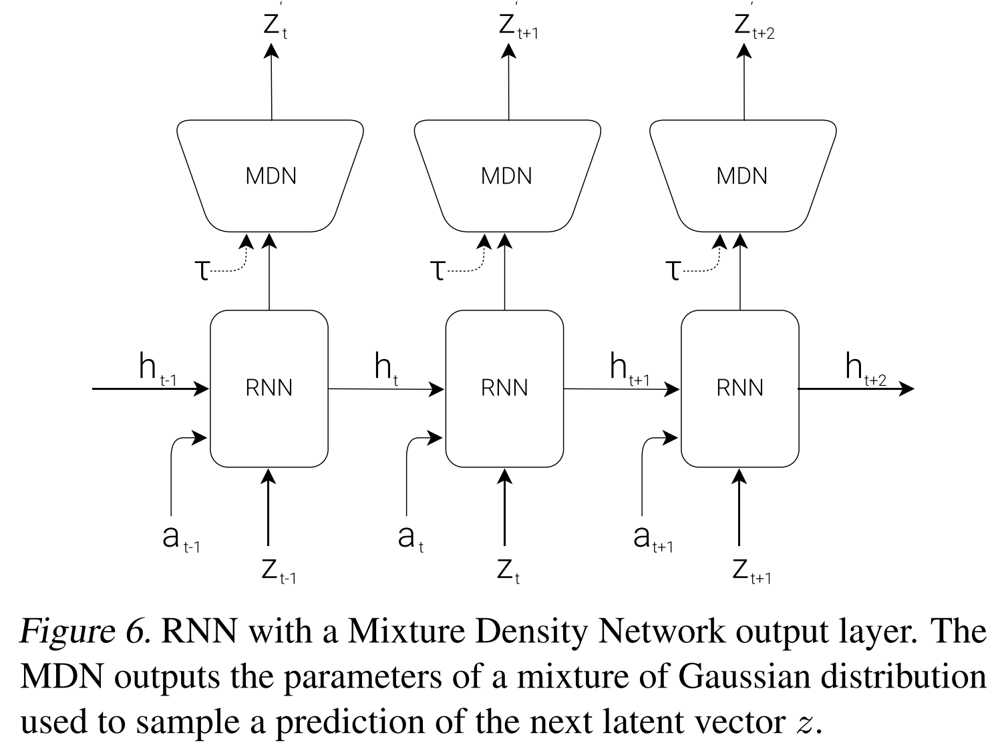
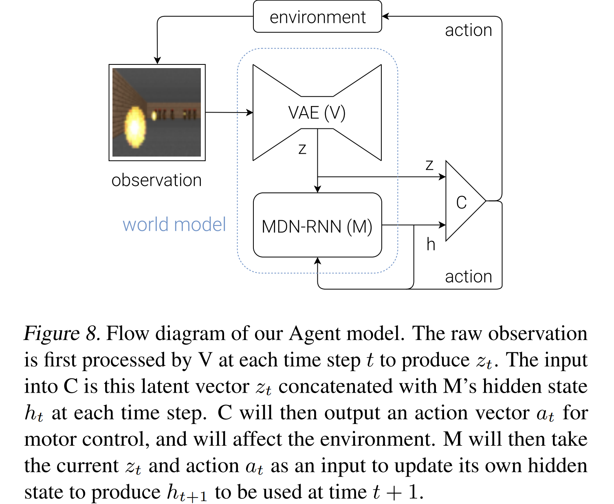

### 논문 한 줄 정리: 강화학습 환경을 신경망 모델로 대체하겠다.

**Abstract**

- World model로부터 나온 feature를 agent(controller)의 input로 사용하여, compact하고 simple한 policy를 학습 시킬 수 있다. (world model로 image를 encoding하여 중요한 feature만 추출한다. 이러한 feature를 input으로 사용하는 것)
- World model은 agent의 dream를 생성하게 되고, agent는 그 dream를 통해 학습할 수 있다. 즉, 상상을 통해 학습할 수 있다.

**Introduction**

- 우리 인간의 뇌는 세상의 모든 것이 아니라, 우리가 살아가는 세상의 추상적인 정보(공간, 시간), 묘사를 기억하고, 배운다.
- 우리가 인지하는 것은, 미래에 대한 뇌의 예측이 많이 섞여 있다.
- 뇌에 있는 예측 모델은 단순 미래를 예측하는 것이 아니라, 현재 운동 상태를 고려했을 때, 앞으로의 감각 데이터를 예측하는 것이다. (따라서 반사 반응이 가능해진다.) → 우리가 100 mph의 공을 칠 수 있는 것은, when and where the ball will go를 예측할 수 있기 때문이다.
- RNN이 크면 (parameter가 많을 수록) 시공간 표현을 더 잘 학습할 수 있지만, 많은 model-free RL은 적은 parameter를 사용한다. 왜냐하면 credit assignment problem 때문에 large model에서 병목이 발생한다. 그래서 지금까지 대부분 작은 networks를 사용하고 있었다. → large RNN-based agents를 학습시키기 위해, model-based 방식(Large world model + small controller model)을 채택했다.

**Agent Model**

- **VAE (V) Model**

video sequence인 2D image를 input으로 받아, abstract, compressed representation. 즉, small latent vector $z$로 압축함.

- **MDN-RNN (M) Model**

predict the future. 앞으로 생길 $z$을 예측하는 모델. environment는 deterministic하지 않고, stochastic하기에, $z_{t+1}$보다는 $p(z_{t+1})$를 출력하도록 train.

$P(z_{t+1} | a_t, z_t, h_t)$

$a_t$ is the action taken at time $t$
$h_t$ is the hidden state of the RNN at time $t$ (즉, 지금까지 봐온 $z$들과 action을 요약한 것 | 기억)

sampling 과정에서 temperature parameter $τ$를 조절할 수 있음. (꿈을 얼마나 불확실하게 만들지. 즉, 미래를 예측할 때, 얼마나 다양하고 무작위적으로 예측하게 할지)

- **Controller (C) Model**

environment에서 agent의 기대 누적 보상을 최대화하기 위해 action의 흐름을 결정함. C를 최대한 간단히 만들고, V와 M과 분리함 (V, M, C는 separately train됨). 이로써 agent 모델의 대부분 복잡성은 world model (V and M)에 존재하게 됨.

$a_t = W_c[z_t, h_t] + b_c$       \
C는 singe layer linear model임.

$W_c$ is the weight matrix and $b_c$ is the bias vector.

- **Flow**

the environment → the raw observation → V → produce $z_t$ → $z_t, h_t$ → C → produce $a_t$ → affect the environment
and $z_t, a_t, h_t$ →  M update hidden state to produce $h_{t+1}$ (predict $z_{t+1}$ through MDN)

논문에서 Controller를 작게 설계하였는데, 이를 통해 여러 가지 실용적인 이득을 볼 수 있었다. 우선 딥러닝은 model을 크고, 복잡하게 훈련할 수 있게 하고, loss function을 differentiable 하게 할 수 있었다. V와 M model을, backpropagation을 통해 훈련할 수 있도록 설계했고, 이를 통해 모델의 복잡도를 형성할 수 있었다. 그래서 대부분의 모델 파라미터는 V, M model에 있다. 이에 비해 C model의 파라미터는 상대적으로 minimal하다. 이를 통해 기존 RL task에 있는 credit assignment problem을 해결할 수 있었다.

C의 파라미터를 최적화하기 위해, CovarianceMatrix Adaptation Evolution Strategy (CMA-ES)를 선택했다.
